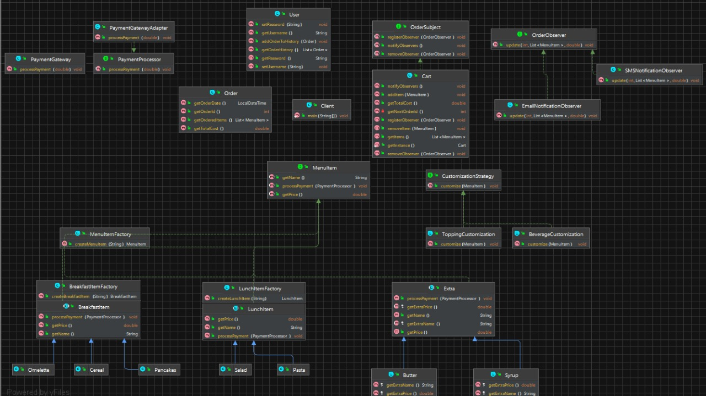

# Breakfast and Lunch Order Management System

## Table of Contents

- [Project Description](#project-description)
- [Key Features](#key-features)
- [Design Patterns](#design-patterns)
    - [Factory Pattern](#factory-pattern)
    - [Singleton Pattern](#singleton-pattern)
    - [Adapter Pattern](#adapter-pattern)
    - [Decorator Pattern](#decorator-pattern)
    - [Strategy Pattern](#strategy-pattern)
    - [Observer Pattern](#observer-pattern)
- [UML Diagram](#uml-diagram-of-project)
## Project Description

The Breakfast and Lunch Order Management System is a Java-based application designed to efficiently manage orders for breakfast and lunch items. This system provides a user-friendly interface for customers to select, customize, and place their meal orders.

Whether you're in the mood for a hearty breakfast or a delicious lunch, this system offers a wide range of menu items that can be customized to your liking. Users can choose from various breakfast and lunch options, add extras, and enjoy a delightful dining experience.

## Key Features
- Menu Item Customization: Users can choose from a selection of menu items and customize their orders. This includes adding toppings, beverages, and extras to create the perfect meal.

- Extensible Menu: The system is designed to accommodate an expanding menu. New breakfast and lunch items can be easily added to the menu, making it versatile and adaptable to changing customer preferences.

- Extras: Enhance your meal with a variety of extras like butter, syrup, and more. The system allows users to personalize their orders to suit their tastes.

- Shopping Cart: A user's selected items are added to a shopping cart, where they can review their order, calculate the total cost, and proceed to payment.

- Payment Processing: Seamless payment processing is integrated into the system. Users can complete their orders securely with a payment gateway.

- Order History: Users can view their order history, including details of previous orders, order dates, and total costs. This feature provides a convenient reference for reordering favorite meals.

- Notification System: Users are notified via email and SMS when they place an order. This real-time communication ensures that customers are kept informed about their orders.
## Design Patterns
The project incorporates several design patterns to enhance its functionality and maintainability:

### Factory Pattern

Description: The Factory Pattern is employed in the project to create various menu items, allowing users to select and customize their orders. 3 factories are used: `MenuItemFactory`, `BreakfastItemFactory` and `LunchItemFactory`. The `MenuItemFactory` creates generic menu items, while the `BreakfastItemFactory` and `LunchItemFactory` creates breakfast-specific and lunch-specific items.

Usage: The Factory Pattern provides an interface for creating objects without specifying the exact class of objects that will be created. This flexibility allows for easy addition of new menu items in the future, making the system highly extensible.

### Singleton Pattern

Description: The Singleton Pattern is employed in the `Cart` class to ensure that there is only one instance of the cart in the system. The `Cart` class uses a private constructor and a static method, `getInstance()`, to guarantee that only one cart instance is created.

Usage: The Singleton Pattern restricts the instantiation of a class to one single instance, ensuring that the class has a global point of access. In this project, it ensures that there is a single shopping cart shared across the system.

### Adapter Pattern

Description: The Adapter Pattern is applied in the project to adapt the `PaymentGateway` class to the `PaymentProcessor` interface. The `PaymentGatewayAdapter` acts as an adapter, allowing the `PaymentGateway` to be used as a `PaymentProcessor` to process payments.

Usage: The Adapter Pattern is used to make two incompatible interfaces work together. It allows objects with incompatible interfaces to collaborate, ensuring that they can interact without the client needing to know the differences between them.

### Decorator Pattern 

Description: The Decorator Pattern is used to add extra features (extras) to menu items, such as butter and syrup. The `Butter` and `Syrup` classes act as decorators, enhancing the behavior of the base menu items, such as omelettes and pancakes.

Usage: The Decorator Pattern allows behavior to be added to individual objects, either statically or dynamically, without affecting the behavior of other objects from the same class. It is used to extend the functionality of objects in a flexible and reusable way.

### Strategy Pattern

Description: The Strategy Pattern is implemented in the project through the use of customization strategies for menu items. Customization strategies, such as `ToppingCustomization` and `BeverageCustomization`, are used to customize menu items like omelettes and pancakes.

Usage: The Strategy Pattern defines a family of algorithms, encapsulates each one, and makes them interchangeable. This pattern allows users to select customizations for menu items dynamically, providing flexibility in customization options.

### Observer Pattern

Description: The Observer Pattern is used to implement a notification system in the project. Users act as observers and are notified when an order is placed. The system notifies registered observers, such as `EmailNotificationObserver` and `SMSNotificationObserver`, when a new order is created.

Usage: The Observer Pattern establishes a one-to-many relationship between an object (the subject) and its dependents (the observers). This pattern provides a flexible way to define a subscription mechanism to notify multiple objects about changes or events.

## UML Diagram of Project
